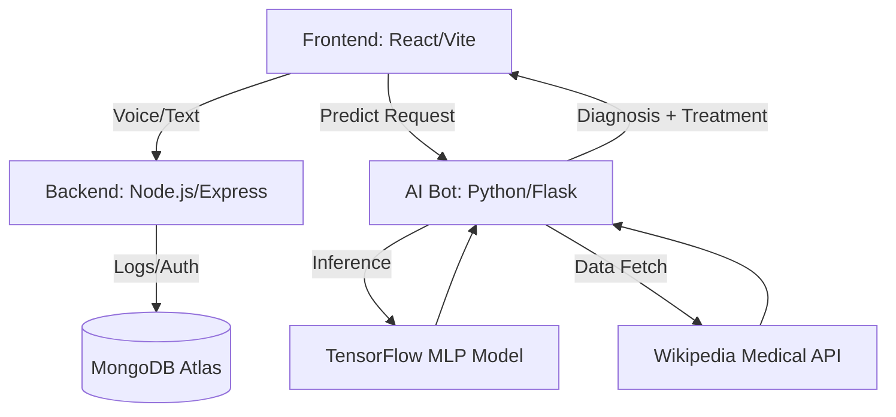

# 🩺 BAYMAX: AI-Powered Healthcare Companion

> **"Hello, I am Baymax, your personal healthcare companion."**

BAYMAX is a high-fidelity, multi-modal AI assistant designed to function as a virtual triage nurse. It interprets user symptoms via voice or text, predicts potential illnesses using a custom-trained **Neural Network (TensorFlow)**, and retrieves clinical treatment protocols from verified medical databases (**Wikipedia API**).

[](https://baymax-frontend-8wcq.onrender.com/)
[](https://github.com/Veerasuryahub/baymax-hcc)
[](https://opensource.org/licenses/MIT)

---

## 🌟 Key Features

-   **🧠 Intelligent Triage**: Uses an Artificial Neural Network (MLP) trained on medical symptom datasets to classify 50+ conditions.
-   **🎙️ Multi-Modal Interaction**: Integrated **Web Speech API** for real-time voice recognition and text-to-speech feedback.
-   **🔬 Hybrid Knowledge Engine**: Combines local ML predictions with real-time clinical data fetching via the Wikipedia Medical API.
-   **🔒 Secure Framework**: JWT-based session management, password hashing (bcrypt), and robust CORS/Helmet security headers.
-   **🛡️ Resilient Infrastructure**: Dual-mode database configuration with an automated fallback to **MongoDB Memory Server** for offline/dev reliability.
-   **📱 Premium UX/UI**: A sleek, Red-and-White "Baymax-core" dashboard built with React and Tailwind CSS, optimized for mobile and desktop.

---

## 🏗️ System Architecture

The project follows a modular, 3-tier architecture designed for scalability and separation of concerns:



---

## 🛠️ Tech Stack

### **Frontend**
-   **Core**: React 18, Vite
-   **Styling**: Tailwind CSS (Custom Theme)
-   **State/Routing**: React Router DOM, Context API
-   **Interaction**: Web Speech API (Recognition & Synthesis)

### **Backend**
-   **Server**: Node.js, Express.js
-   **Database**: MongoDB (Mongoose), MongoDB Memory Server (Fallback)
-   **Security**: JWT, Bcrypt, Helmet, CORS, Express-Rate-Limit

### **AI / Machine Learning**
-   **Framework**: TensorFlow, Keras
-   **Engine**: Python, Flask
-   **Data**: Wikipedia-API, NumPy, Joblib

---

## ⚙️ Installation & Setup

### **Prerequisites**
-   Node.js (v16+)
-   Python (v3.9+)
-   MongoDB Account (Optional, falls back to Memory Server)

### **1. Clone the Repository**
```bash
git clone https://github.com/Veerasuryahub/baymax-hcc.git
cd baymax-hcc
```

### **2. Setup Backend**
```bash
cd backend
npm install
# Add .env with MONGO_URI and JWT_SECRET
npm start
```

### **3. Setup AI Bot**
```bash
cd ../Bot
pip install -r requirements.txt
python app.py
```

### **4. Setup Frontend**
```bash
cd ../front
npm install
npm run dev
```

---

## 🤝 Contribution

Contributions are what make the open-source community such an amazing place to learn, inspire, and create. Any contributions you make are **greatly appreciated**.

1. Fork the Project
2. Create your Feature Branch (`git checkout -b feature/AmazingFeature`)
3. Commit your Changes (`git commit -m 'Add some AmazingFeature'`)
4. Push to the Branch (`git push origin feature/AmazingFeature`)
5. Open a Pull Request

---

## 📜 License

Distributed under the MIT License. See `LICENSE` for more information.

---

## 📬 Contact

**Veerasurya** - [GitHub](https://github.com/Veerasuryahub)
Project Link: [https://github.com/Veerasuryahub/baymax-hcc](https://github.com/Veerasuryahub/baymax-hcc)
